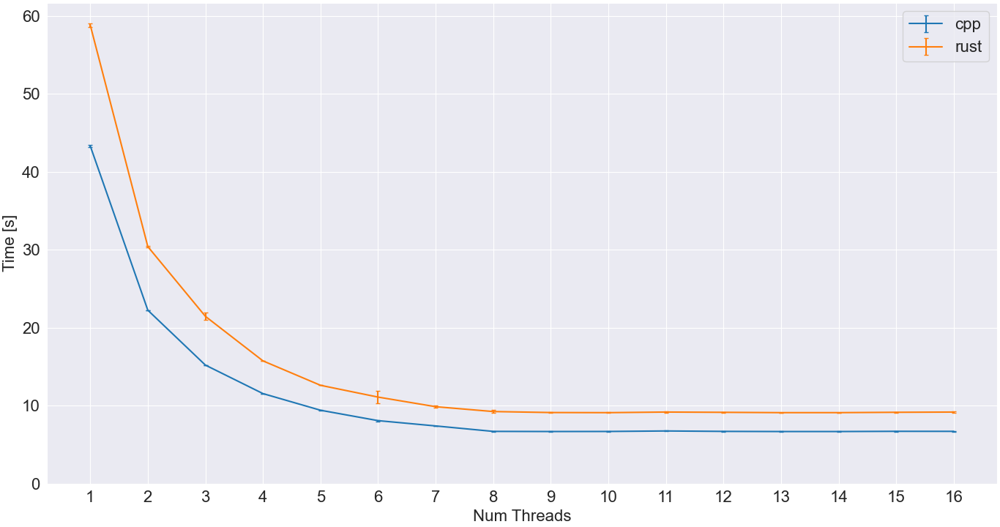
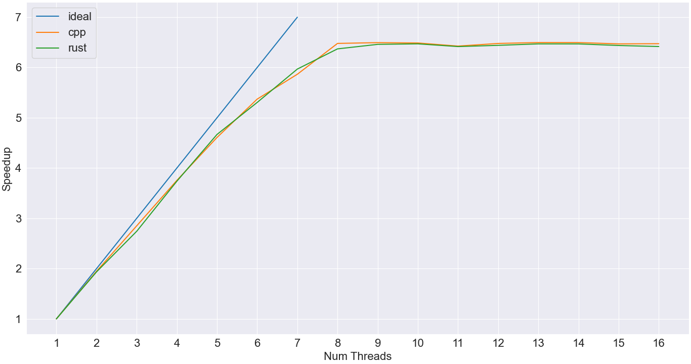

# Performance Comparison Mandelbrot

### Mandelbrot

The Mandelbrot set is the set of complex numbers for which the sequence fc(0), fc(fc(0)), etc, remains bounded in absolute value. Its definition and name are due to Adrien Douady, in tribute to the mathematician Benoit Mandelbrot.

### Metodologia

Foram testados três programas, um código sequencial para controle, um em C++ paralelizado utilizando threads da melhor forma encontrada pelo autor e um em rust, por motivos de curiosidade, paralelizado utilizando uma biblioteca de alto nivel.

* C++ sequencial
* C++ paralelizado
* Rust paralelizado

Todos os programas foram implementados de forma similar e recebem a mesma [entrada](mandelbrot.in).

O código fonte se encontra nas pastas [seq](seq/mandelbrot.cpp), [cpp](cpp/mandelbrot.cpp) e [rust](rust/src/main.rs).

De modo a medir o impacto do número de threads na performance dos programas foram realizados testes utilizando de uma a dezeseis threads.

Para cada teste foram realizados dez execuções para garantir o valor estatisco dos resultados, adquirindo a média e desvio padrão.

### Realizar os testes

Para realizar os testes basta executar o script [`bench.sh`](bench.sh).

```bash
./bench.sh
```

O script gerara saidas no terminal e nos diretórios log, out e plot.

O gráfico que comtem a comparação da performance dos programas ficara localizado na pasta plot.

### Hardware utilizados

Os resultados descritos na seção [resultados](#resultados) foram adquiridos utilizando o seguinte hardware:

```
OS: macOS 12.5 21G72 arm64
CPU: Apple M1 Pro 8-Core
GPU: Apple M1 Pro 14-Core
Storage: 512GB SSD
Memory: 16384MiB
```

### Resultados

O gráfico abaixo contem os resultados de execução, estão tracados os três programas, estes podem ser identificados pela legenda,
cada linha passa pela média do tempo de execução e as linhas verticais representam o desvio padrão.



O gráfico abaixo demonstra a relação de speed de cada programa em relação ao seu tempo sequencial.



Podemos ver claramente o impacto que a paralelização tem no desempenho, no entanto o ganho de performance foi diminuindo conforme mais threads são adicionadas, além disso, não houve ganho nenhum ao adicionar mais threads que a quantidade de cores do processador.

O resultado de diversas otimizações foi um speedup de 650%.

Notasse uma performance equivalente das linguagens Rust e C++.
